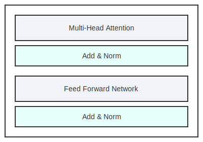
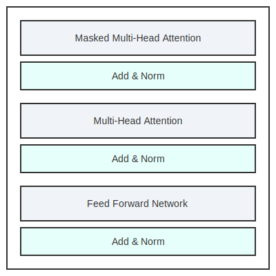

# tf-transformer

A TensorFlow implementation of the Transformer model, based on the paper "Attention Is All You Need".

## Description

This project provides a clear and concise implementation of the Transformer architecture. It includes all the core components:

* **Multi-Head Attention:** The core attention mechanism.
* **Position-wise Feed-Forward Networks:** The fully connected layers in the model.
* **Positional Encoding:** To give the model information about the relative or absolute position of the tokens in the sequence.
* **Encoder and Decoder:** The two main parts of the Transformer architecture.

The implementation is structured into modular components, making it easy to understand and extend.

## Installation

1. Clone the repository:

    ```bash
    git clone https://github.com/s-h-moeladi/tf-transformer.git
    cd tf-transformer
    ```

2. Install the dependencies:

    ```bash
    pip install .
    ```

## Usage

The `src/tf_transformer/main.py` file provides an example of how to initialize and run the Transformer model.

```python
import tensorflow as tf
from tf_transformer.transformer import Transformer

# Defining Custom Parameters.
num_layers = 4
d_model = 128
num_heads = 8
dff = 512
input_vocab_size = 8500
target_vocab_size = 8000
maximum_position_encoding = 10000
dropout_rate = 0.1

transformer = Transformer(
    num_layers,
    d_model,
    num_heads,
    dff,
    input_vocab_size,
    target_vocab_size,
    maximum_position_encoding,
    dropout_rate,
)

inputs = tf.random.uniform(
    (64, 50), dtype=tf.int64, minval=0, maxval=input_vocab_size
)
targets = tf.random.uniform(
    (64, 50), dtype=tf.int64, minval=0, maxval=target_vocab_size
)

output = transformer(
    (inputs, targets),
    training=True,
    look_ahead_mask=None,
    padding_mask=None,
)

print(output.shape)
```

You can run this example with:

```bash
python -m src.tf_transformer.main
```

Or you can use the installed script:

```bash
tf-transformer
```

## Model Architecture

The model follows the original Transformer architecture, consisting of an Encoder and a Decoder.

### Encoder

The Encoder is made up of a stack of `N` identical layers. Each layer has two sub-layers:

1. A multi-head self-attention mechanism.
2. A position-wise, fully connected feed-forward network.

Each of these sub-layers has a residual connection around it, followed by a layer normalization. The output of each sub-layer is `LayerNorm(x + Sublayer(x))`, where `Sublayer(x)` is the function implemented by the sub-layer itself.

The following diagram shows the architecture of the Encoder:



### Decoder

The Decoder is also composed of a stack of `N` identical layers. In addition to the two sub-layers in each encoder layer, the decoder inserts a third sub-layer, which performs multi-head attention over the output of the encoder stack.

The following diagram shows the architecture of the Decoder:



---

This project is intended for educational purposes and as a starting point for building more complex models based on the Transformer architecture.
